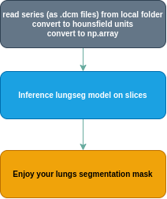

# LungSeg - Segmentation lungs (thoracic region) on CT using Unet-based CNN model

Many medical image processing tasks focus mainly on finding a pathology. For example, during CT cancer screening we mostly detect nodules on an image. But our models are not perfect (like everything in the world), and we occasionally find lung nodules in the intestine or even outside the body. For this reason, it’s significant to have a mask of the target organ explicitly to be able to subtract false detected regions outside.
Today the [Botkin.AI](https://botkin.ai/) team is happy to present an open source solution for lung segmentation on CT images, which is called [**lungseg**](https://github.com/Botkin-AI/lungseg).
It is robust to a high density tissue in lungs and to body orientation. Mostly it inherits a markup protocol from the [NSCLC dataset](https://wiki.cancerimagingarchive.net/pages/viewpage.action?pageId=68551327#68551327bcab02c187174a288dbcbf95d26179e8).

This package allows generating pixel-wise segmentation to medical CT images in axial projection. Our approach based on Unet model uses volumetric information of CT scan.


**Enjoy it in your research and pet projects!**


## Installation 
### Requirements (see in `requirements.txt`)

* python >=3.6
* [pytorch >=1.0.0](https://pytorch.org/)
* [pydicom >=1.0.0](https://github.com/pydicom/pydicom)


### Installation as a pip package
```
pip install git+https://github.com/Botkin-AI/lungseg.git
```

## Usage
General pipeline of usage is following:



```python
import lungseg
from lungseg.dcm_reader import SeriesLoader

dicom = SeriesLoader(folder_to_dicoms=path_dcm)
segmentor = lungseg.LungSegmentor()
lung_mask = segmentor.predict(dicom.slices, batch_size=your_batch_size)
```

It's also possible to make prediction on only slice, for this needs use LungSegmentor().predict_one_slice(slice). Data in this case also should be converted to HU.

More example of usage you can find in [JupyterNotebook](https://github.com/Botkin-AI/lungseg/blob/master/lungseg/example_run_on_NSCLC.ipynb)

